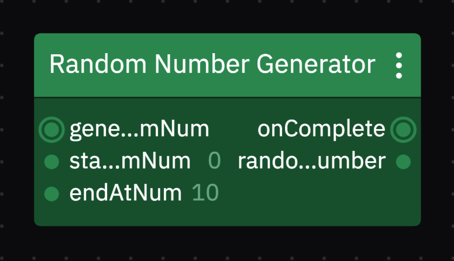

# Random Number Generator | Custom Code Component

**Description**
This is a custom code components that generates a random number.

**How it works**
It uses the [Uiflow CLI](https://www.npmjs.com/package/@uiflow/cli), to create a custom code component for [Uiflow Studio](https://www.uiflow.com).

It takes in two numbers and generates a random number, by default it's `0` - `10`.

### Screenshot

### How to use

- Instruction to install CLI, test the component and publish [here](https://docs.uiflow.com/uiflow/build-custom-studio-components/install-uiflow-cli)

- Video tutorial coming soon 